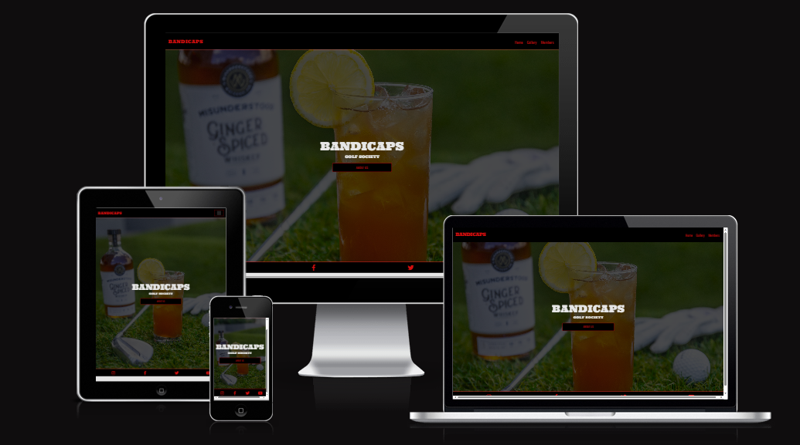
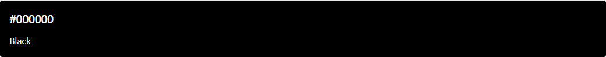
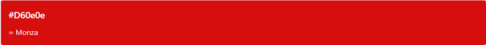
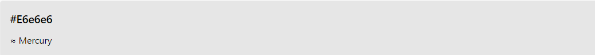

# Bandicaps Golf Society website and members log in - HTML, CSS, Bootstrap.

## 3 page static website written in HMTL, CSS and Bootstrap. Small project for a Golf Society.

This is my first milestone project for CodeInstitute. The requirements are to create a 3 page static website using HTML and CSS (Boostrap and other libraries are optional). This is a website for a local golf society that I am a part of, it showcases a relaxed approach to a technically demanding sport. The website explains who and what the society are, it holds a gallery, information on the next events and options to become a member. The website was created with a mobile first approach.

# User Stories

- I am Low handicap golfer who is looking to make friends and play regularly, however I do love to play competitively.
- I am High handicap golfer who is looking to improve but not take the game to seriously.
- I am a golfer who is a part of many golf society's, looking to have fun whilst playing the game I love.

# Contents

- [Home](#home)
- [Gallery](#gallery)
- [Members](#members)
- [Navbar](#navbar)
- [Footer](#footer)
- [Color Schemes](#color-schemes)
- [Fonts](#fonts)
- [Images](#images)
- [Wireframes](#wireframes)

The website is made of of 3 pages:

# Home

When creating the initial wireframes for the Home page, I wanted the user to have a good first impression. The page needed to feel welcoming but also interesting with a simple and sleek design. It would be hard for someone who doesn't know what a golf society is to understand what this website could be if it was to 'busy' on the first page, having gained the interest of the user I have made it easy for them to find out more through the 'about us' button.

- Background image: I chose this image as it replicates what the bandicaps are. A Golf Society that take a laid back approach to the sport. The picture shows a Golf club, Golf ball, Golf glove, A glass of whiskey(with an orange in) and a bottle of Whiskey.

- Centered large title

- Clickable button that takes you to the 'Gallery' where the user can find out more.

# Gallery

The page starts with a simple header and subheader with following text that explains what and who the 'BANDICAPS' are. The gallery is a visual representation of what the 'about us' paragraph explains. I want the gallery to give the user a sense of commamadarie when viewing the gallery, this is where the user gets to see the members of the society doing what they love. I wanted it to showcase the value of having a good time whilst playing golf. The page then finished with the 'The Bandicaps Open' which gives a brief look into the competitions that are held in the society. I used styled line breaks to separate the about us and gallery.

- about us header and paragraph - following on from the homepage styling, I didn't want to make this page look busy. I made it so the user has a simple but informative paragraph to read.

- Gallery - I chose images that represented a good social time with healthy competition. The layout was difficult however I opted to use bootstrap for the gallery image positioning. Initially I used a responsive image template on bootstrap but I couldn't re-size the images to scale correctly.

- The Bandicaps Open - The bandicaps open is why the bandicaps are a golf society, it is the main event for the bandicaps where all members get together and play a golf tournament. I have made this section for users to get a glimpse of what competition is like in the golf society. it tells the user where the previous open was played, the current champion and where the next open is to be played.

# Members

This is a Members Log in section combined with a member application option.

- Form - I used a template from boostrap for the form. a simple floating design that gives the user and option to keep their device logged in.

- Member application - An option to become a member by downloading an application form (fake application form).

# Navbar

I used a responsive navbar from bootstrap template. a simple design with branding and navigation.

# footer

The footer is a simple 4 column boostrap template that I customised to showcase the golf society socials.

# Color Schemes

The main colour scheme consists of a solid black (rgb(0, 0, 0)) & a slightly dark shade of red (rgb(216, 14, 14)). Initially i had used a bright red for the site however it was too bright so I opted for the darker which i beleive it easier to look at.

Black rgb(0,0,0)

Red rgb(216,14,14)

Mercury (#e6e6e6)

# Fonts

I used google fonts.

I chose 'Ultra' for the bandicaps branding and headers in the navbar as it gives a 'Wild West feel' incorporating the name 'Bandit' which is what bandicaps is Bandit + Golf Handicap.

I have used 'Oswald' for paragraphs and subheadings. I beleive it fits well with 'Ultra', it doesn't make 'Ultra' look out of place and is an easy font to read.

# Images

All images where used from Unsplash.com

# Wireframes
