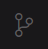
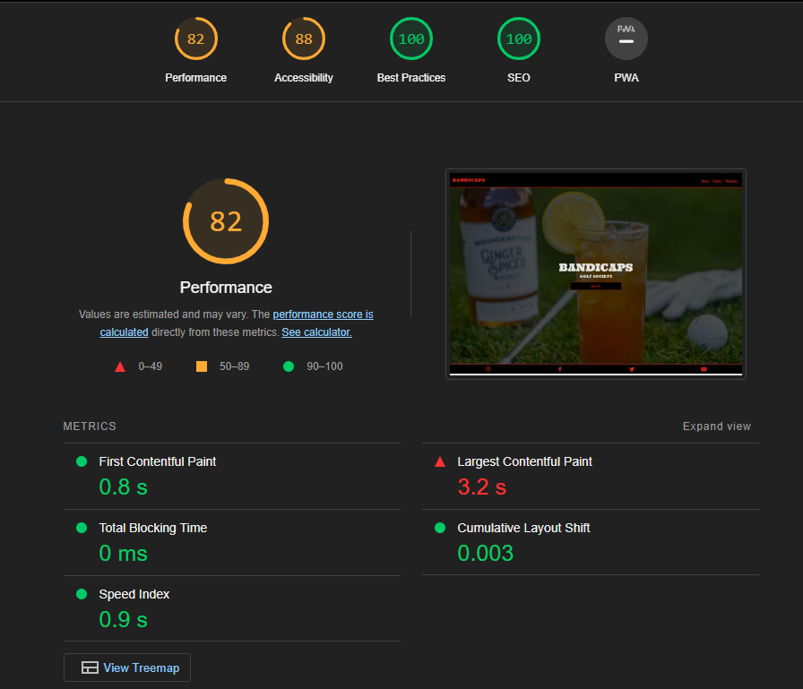

# Bandicaps Golf Society website and members log in - HTML, CSS, Bootstrap.

## 3 page static website written in HMTL, CSS and Bootstrap. Small project for a Golf Society.

This is my first milestone project for CodeInstitute. The requirements are to create a 3 page static website using HTML and CSS (Boostrap and other libraries are optional). This is a website for a local golf society that I am a part of, it showcases a relaxed approach to a technically demanding sport. The website explains who and what the society are, it holds a gallery, information on the next events and options to become a member. The website was created with a mobile first approach.

# User Stories

- I am Low handicap golfer who is looking to make friends and play regularly, however I do love to play competitively.
- I am High handicap golfer who is looking to improve but not take the game to seriously.
- I am a golfer who is a part of many golf society's, looking to have fun whilst playing the game I love.

# Contents

- [Home](#home)
- [Gallery](#gallery)
- [Members](#members)
- [Navbar](#navbar)
- [Footer](#footer)
- [Color Schemes](#color-schemes)
- [Fonts](#fonts)
- [Images](#images)
- [Wireframes](#wireframes)
- [Technologies used](#technologies-used)
- [Languages used](#languages-used)
- [Frameworks and Libraries](#frameworks-and-libraries)
- [Deployment](#deployment)
- [Testing & Validation](#testing--validation)
- [Performance](#performance)

# Home

When creating the initial wireframes for the Home page, I wanted the user to have a good first impression. The page needed to feel welcoming but also interesting with a simple and sleek design. It would be hard for someone who doesn't know what a golf society is to understand what this website could be if it was to 'busy' on the first page, having gained the interest of the user I have made it easy for them to find out more through the 'about us' button.

- Background image: I chose this image as it replicates what the bandicaps are. A Golf Society that take a laid back approach to the sport. The picture shows a Golf club, Golf ball, Golf glove, A glass of whiskey(with an orange in) and a bottle of Whiskey.

- Centered large title

- Clickable button that takes you to the 'Gallery' where the user can find out more.

# Gallery

The page starts with a simple header and subheader with following text that explains what and who the 'BANDICAPS' are. The gallery is a visual representation of what the 'about us' paragraph explains. I want the gallery to give the user a sense of commamadarie when viewing the gallery, this is where the user gets to see the members of the society doing what they love. I wanted it to showcase the value of having a good time whilst playing golf. The page then finished with the 'The Bandicaps Open' which gives a brief look into the competitions that are held in the society. I used styled line breaks to separate the about us and gallery.

- about us header and paragraph - following on from the homepage styling, I didn't want to make this page look busy. I made it so the user has a simple but informative paragraph to read.

- Gallery - I chose images that represented a good social time with healthy competition. The layout was difficult however I opted to use bootstrap for the gallery image positioning. Initially I used a responsive image template on bootstrap but I couldn't re-size the images to scale correctly.

- The Bandicaps Open - The bandicaps open is why the bandicaps are a golf society, it is the main event for the bandicaps where all members get together and play a golf tournament. I have made this section for users to get a glimpse of what competition is like in the golf society. it tells the user where the previous open was played, the current champion and where the next open is to be played.

# Members

This is a Members Log in section combined with a member application option.

- Form - I used a template from boostrap for the form. a simple floating design that gives the user and option to keep their device logged in.

# Navbar

I used a responsive navbar from bootstrap template. a simple design with branding and navigation.

Responsive Navbar

# footer

The footer is a simple 4 column boostrap template that I customised to showcase the golf society socials.

# Color Schemes

The main colour scheme consists of a solid black (rgb(0, 0, 0)) & a slightly dark shade of red (rgb(216, 14, 14)). Initially i had used a bright red for the site however it was too bright so I opted for the darker which i beleive it easier to look at.

Black rgb(0,0,0)

Red rgb(216,14,14)

Mercury (#e6e6e6)

# Fonts

I used google fonts.

I chose 'Ultra' for the bandicaps branding and headers in the navbar as it gives a 'Wild West feel' incorporating the name 'Bandit' which is what bandicaps is Bandit + Golf Handicap.

I have used 'Oswald' for paragraphs and subheadings. I beleive it fits well with 'Ultra', it doesn't make 'Ultra' look out of place and is an easy font to read.

# Images

All images where used from Unsplash.com

# Wireframes

Home page across all devices

Gallery Page across all devices

Members Page across all devices

# Technologies used:

- GitHub - Used for storage of the website and publishing online.
- VScode - The IDE used for editing code and pushing changes
- HTML5 - Core website built in HTML5
- CSS - Used to style the website layout and imagery
- Bootstrap - Bootstrap was used for structuring of certian features such as Navbar, Footer and Gallery
- Font Awesome - Used for Icon styling
- Unsplash - Used to generate images

## Languages used:

HTML, CSS, JavaScript

## Frameworks and Libraries:

Bootstrap & GitHub

# Deployment

I deployed my website using GitPages. To do this, the steps are as follows:

(I documented any changes through VS source control tab)

- Once you have made changes to your code, click the Source Control tab in the activity bar.

- Select the changes you wish to commit by clicking the + symbol next to the file name (you can commit seperate changes in one push to the respository)

- Once you have given a message to all of the committed changes you will see a 'Sync' option. Click that to push the code to your git repository.

- Go to your repository, you will see that the changes have been made. On the right side of the main branch you should see the 'Deployments link'.

- From there you can click on the link to you deployed website. You can also take a look at the history of deployments.

## How to Clone

- Log into your account on github
- Go to the repository of this project /Kyde91/Milestone-Project/
- Click on the code button, and copy your preferred clone link.
- Open the terminal in your code editor and change the current working directory to the location you want to use for the cloned directory.
- Type 'git clone' into the terminal, paste the link you copied in step 3 and press enter.
  How to Fork

## To fork the repository:

- Log in (or sign up) to Github.
- Go to the repository for this project, Kyde91/Milestone-Project
- Click the Fork button in the top right corner.

# Testing & Validation:

## Manual testing

Manual testing conducted

- Navbar

* Navlinks

- Footer

* Social Media Links

- Members

* Form posts
* form validation works

## Jigsaw CSS Validator

I used Jigsaw to validate CSS code - Passed!

## W3C Validator

W3C was used to validate HTML on all 3 pages - Passed!

# Performance

## Lighthouse performance statistics

# Future Features

Last but not least, future features. I aim to give this site more components and functionality through the following ideas:

- Profiles for members. They will be able to log in update their information such as Handicap, Best round, how many championships.
- Live leaderboard for 'The Bandicaps Open'.
- Downloadable application form
- Social Events page
